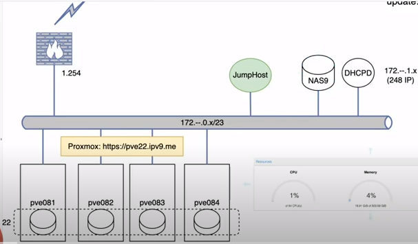

# SPCN-012

# 
สรุปความเข้าใจในการสร้าง VM ใน Proxmox

ในการสร้าง Virtual Vachine(VM) หรือสร้าง [Container](#container-technology) เพื่อสร้างสภาพแวดล้อมเฉพาะสำหรับ Software โดย ทำงานไม่กินทรัพยากรณ์ของเครื่อง Local จึงนำ [Proxmox](#proxmox) มาใช้งาน เพราะมีบริการในการสร้าง [Hypervisor](#hypervisor-technology) เพื่อจำลอง ฮาร์ดแวร์คอมพิวเตอร์ ซอฟต์แวร์ หรือเฟิร์มแวร์ เพื่อใช้ในการรองรับการติดตั้ง Virtual Vachine(VM) หรือ [Container](#container-technology)  และเป็นตัวกลางระหว่างเครื่องจำลอง กับ Local โดยตัวเครื่อง Host เปิดให้บริการแต่ล่ะเครื่อง Local มาใช้งาน โดยรูปแบบการเก็บข้อมูลจะเป็นแบบ [Ceph](#ceph) ซึ่งจะมีลักษณะ Distributed Storage จะทำงานใน Cluster ซึ่งรูปแบบ Server จะเป็นแบบ [Microservice](#monolithic-microservice) จะเป็นการแบ่งย่อยการทำงานของ Server ทำให้ไม่มีความกระจุกกันของข้อมูล และ [Proxmox](#proxmox) สามารถให้บริการ ิ[NFS](#nfs) จะเป็นบริการที่สามารถให้เครื่อง Local แต่ละตัวที่มาใช้งาน [Hypervisor](#hypervisor-technology) สามารถส่งไฟล์หาถึงกันได้ นี่คือข้อสรุปการสร้าง VM ใน [Proxmox](#proxmox) 

------
## Hypervisor Technology 
* **Hypervisor** คือการจำลอง ฮาร์ดแวร์คอมพิวเตอร์ ซอฟต์แวร์ หรือเฟิร์มแวร์ที่สร้างเครื่องเสมือนที่มีการจัดการ การจัดสรรทรัพยากรแล้ว โดยเครื่องเสมือนแต่ละเครื่องสามารถเรียกใช้และระบบปฏิการในตัวมันเองได้ โดย โฮสต์ ใช้เรียกเครื่องสำหรับคอมพิวเตอร์ที่ติดตั้ง Hypervisor ส่วนที่เราสร้างเป็นเครื่องเสมือน เรียกว่า เครื่องแขก

    โดย Hypervisor ทำหน้าที่เป็นตัวกลางระหว่างเครื่องโฮสต์และเครื่องเสมือน ทำหน้าที่ประสานการเข้าถึงสภาพแวดล้อมทางกายภาพให้เครื่องเสมือนหลายเครื่องสามารถเข้าถึงทรัพยากรร่วมกันได้ ทำให้ระบบปฏิบัติการหลายระบบสามารถทำงานพร้อมกันบน โฮสต์ ได้ และตั้งค่าระบบไม่ให้เกิดการทำงานที่ทับซ้อนหรือรบกวนกัน โดยบางครั้งเราอาจเรียก **Hypervisor เป็น Virtual Machine Management (VMM)**

ref: https://en.wikipedia.org/wiki/Hypervisor

    [top⬆️](#spcn-012)
## Container Technology 
* **Container** เป็นการสร้างสภาพแวดล้อมเฉพาะที่ทำให้ซอฟต์แวร์ทำงานได้โดยไม่รบกวนซอฟต์แวร์ตัวอื่นบนระบบปฏิบัติเดียวกัน สามารถการจัดเก็บแอปพลิเคชั่นให้อยู่ในรูปแบบที่ง่ายต่อการโยกย้ายและนำขึ้นระบบ ประกอบไปด้วยตัวแอปพลิเคชั่นเอง library หรือ binary ที่จำเป็นในการ run แอปพลิเคชั่นนั้นๆ และการกำหนดค่าต่างๆ ของแอปพลิเคชั่นนั้น เมื่อเวลาย้ายตัวแอปพลิเคชั่นไหนที่ถูกจัดเก็บเป็น **container** แล้วนำไป run ที่อื่นก็สามารถใช้ทำงานได้โดยไม่ต้องสนใจถึงระบบปฏิบัติการ เพราะสามารถทำงานในทุกประเภทของระบบปฏิบัติการ

ref: https://en.wikipedia.org/wiki/Containerization_(computing)

    [top⬆️](#spcn-012)
## Monolithic MicroService 
* **Monolithic หรือ Monolithic  Architecture** สถาปัตยกรรมการออกแบบซอฟต์แวร์หรือ Service ที่มีคนใช้งานเป็นจำนวนมากและมีมาอย่างยาวนาน ลักษณะของระบบที่การทำงานทุกอย่างจะรวมอยู่ในกลุ่มก้อนเดียวกันและใช้งาน Database เดียวกัน

* **Microservice หรือ Microservice  Architecture** คือสถาปัตยกรรมการออกแบบ Service หรือคือออกแบบเซิร์ฟเวอร์ ที่ในชื่อมีคำว่า Micro นำหน้าอยู่ จะออกแบบโดยแยกการทำงานที่รวมกันเป็นก้อนใหญ่ของแบบ **Monolithic** ออกมาให้เล็ก อาจแยกตามบริบทหรือตามฟังก์ชันการทำงาน

ref: https://en.wikipedia.org/wiki/Microservices 
     https://en.wikipedia.org/wiki/Monolithic_application

    [top⬆️](#spcn-012)
## Proxmox 
* **Proxmox หรือ Proxmox VE** แพลตฟอร์มที่จะมาช่วยในเรื่องการจัดการเซิร์ฟเวอร์เสมือน โดยผสานเข้าร่วมกับ Hypervisor และ Linux Container (LXC) ไว้บนแพลตฟอร์มเดียว โดยจะจัดเก็บข้อมูลและฟังก์ชันการทำงานของระบบเครือข่ายและสามารถจัดการกลุ่มการเข้าถึงข้อมูลที่มีประสิทธิภาพ และมีเครื่องมือการกู้ระบบได้ด้วยผ่านการควบคุมหน้าเว็บไซต์และสามารถจัดการกับ Virtual Machine ของเราได้อย่างมีประสิทธิภาพ ไม่ว่าจะเป็นการควบคุมหรือการสร้าง Virtual Environment ขึ้นมา คล้ายกับ ESXi ของ VMware โดยจะสามารถรองรับหรือให้บริการ HCI หรือที่เราเรียกกันว่า Hyper Converged Infrastructure เหมาะสำหรับการใช้งานองค์กร

ref: https://en.wikipedia.org/wiki/Proxmox_Virtual_Environment

    [top⬆️](#spcn-012)
## Ceph
* 	**Ceph Storage เป็นระบบ distributed storage** แบบหนึ่งที่ทำงานบน **cluster** ของ computer node ประกอบด้วย node 3 ประเภท คือ 
    1)	Monitor ทำหน้าที่ดูแลสถานะของ cluster
    2)	Object Storage Device (OSD) ทำหน้าที่อ่าน/เขียนข้อมูลตามคำสั่งของผู้ใช้ 
    3)	Metadate Server (MSD) ทำหน้าที่ดูแลสถานะของ file hierarchy (ใช้เฉพาะงาน Ceph Storage กับ CephFS เท่านั้น)

    Ceph Storage ทำงานบน cluster ที่แต่ละ mode ทำหน้าที่แตกต่างกันอย่างชัดเจน ทำให้การบริหารจัดการสะดวก workload ถูกกระจายอย่างเหมาะสม ลดความเสี่ยงจาก system failure และทำให้ scale ได้ง่าย

	**Ceph Storage เป็น Software-defined storage (SDS)** ที่ถูกออกแบบมาให้ติดตั้งบน All-flash sever-class hardware ไปถึง Commodity off-the-shelf hardware (คอมพิวเตอร์ที่ใช้ตามบ้านทั่วไป) หรือ Single-board computer ทำให้ผู้ใช้มีอิสระในการเลือกฮาร์ดแวร์สำหรับ storage ให้ตรงกับงบประมาณและ performance requirements มากขึ้น

    กล่าวคือ **Ceph Storage** มีความสามารถและคุณสมบัติช่วยรักษาข้อมูลคงทนถาวรมากขื้น ส่วนใหญ่ตั้งให้ทำงานโดยอัตโนมัติโดยผู้ใช้ไม่ต้องทำอะไรเพิ่ม  เพียงบันทึกข้อมูลลงไปในระบบ ข้อมูลนั้นจะถูก replicate หรือ กระจายไปเก็บหลายๆ ที่เองโดยอัตโนมัติ

ref: https://en.wikipedia.org/wiki/Ceph_(software)

    [top⬆️](#spcn-012)
## NFS 
* **NFS (Network File System)** บริการที่ทำให้เครื่องคอมพิวเตอร์สามารถแชร์ File และ Directory ผ่าน Network บนเครื่องคอมพิวเตอร์เครื่องอื่นได้เหมือนกับใช้งานเครื่องของตัวเองได้อย่างสะดวก ง่าย และมีประสิทธิภาพ โดยระบบปฏิบัติการของเครื่องลูกข่ายไม่จำเป็นต้องเป็นระบบปฏิบัติการเดียวกันกับเครื่องแม่ข่าย 

    **รูปแบบการทำงานของ NFS จะเป็น Server และ Client** ทำให้คอมพิวเตอร์หลายๆ เครื่องใน Local Network เดียวกันสามารถเข้าถึงไฟล์ได้ โดยในฝั่งของ Server ผู้ที่มีหน้าที่ดูแลระบบจะทำการตั้งค่า Folder ว่า Folder ไหนจะทำการแชร์ผ่าน Network ฝั่งของ Client ก็จะต้อง Mount ไฟล์ผ่าน Network โดยใช้คำสั่ง Mount ด้วยการทำแบบนี้ ทำให้มุมมองในการใช้งานของฝั่ง Client ที่ Mount ผ่านทาง Network ด้วย NFS จะให้ความรู้สึกเหมือนกับว่าเราใช้งานไฟล์จากในเครื่องคอมพิวเตอร์ของเราเอง

ref: https://en.wikipedia.org/wiki/Network_File_System

    [top⬆️](#spcn-012)
